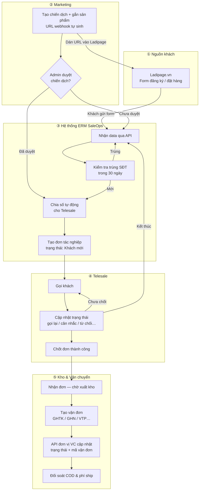

# ERM SaleOps — Luồng nghiệp vụ & Hướng dẫn sử dụng

> **Dành cho:** Quản lý, Marketing, Telesale, Kho, Kế toán, Chia số — không cần biết lập trình.  
> Chi tiết kỹ thuật API/webhook: xem [API_AND_ROUTES.md](./API_AND_ROUTES.md).

---

## 1. Tổng quan sản phẩm

**ERM SaleOps** quản lý toàn bộ chuỗi bán hàng: từ quảng cáo / landing page → lead → telesale chốt đơn → kho xuất hàng → vận chuyển → kế toán đối soát → ban lãnh đạo theo dõi KPI realtime.

### Vì sao cần hệ thống này?

| Vấn đề thường gặp | ERM SaleOps giải quyết |
|-------------------|------------------------|
| Khách để SĐT nhưng không ai gọi kịp / gọi trùng | Lead tự động vào hệ thống, chia số công bằng, chống trùng SĐT |
| Marketing không biết lead nào ra đơn | Báo cáo theo nguồn, campaign, UTM, marketer |
| Sale chốt xong kho không biết | Đơn chốt tự chuyển sang pipeline kho |
| Trạng thái giao hàng nhập tay, sai COD | Webhook vận chuyển cập nhật tự động (khi bật tích hợp) |

### Luồng nghiệp vụ chính

```text
Marketing chạy ads / form / landing
    → Lead đổ về hệ thống
    → Telesale nhận data, gọi, chăm sóc, chốt đơn
    → Kho xác nhận tồn, đóng gói, chuyển đơn vị giao hàng
    → Kế toán kiểm tra COD, chuyển khoản, đối soát
    → CEO/Admin xem báo cáo tổng hợp realtime
```

---

## 2. Hành trình khách hàng (end-to-end)

Biểu đồ mô tả hành trình từ Ladipage đến đối soát tiền.



---

## 3. Vai trò — Ai làm gì?

| Vai trò | Mã | Email demo | Việc chính |
|---------|-----|------------|------------|
| **Quản trị** | `admin` | `admin@saleops.local` | Toàn hệ thống: báo cáo CEO, duyệt landing, tích hợp, vận hành, lịch sử nhập xuất kho |
| **Telesale** | `sales` | `sales@saleops.local` | Gọi khách, chuyển trạng thái, chốt đơn — chỉ thấy đơn được gán |
| **Marketing** | `marketing` | `marketing@saleops.local` | Tạo chiến dịch, copy URL webhook sang Ladipage, xem hiệu quả |
| **Kho** | `warehouse` | `warehouse@saleops.local` | Xuất hàng, tạo vận đơn, quản lý tồn — phiếu nhập/xuất cần trưởng kho duyệt |
| **Chia số** | `allocator` | `allocator@saleops.local` | Theo dõi lead, xử lý lead chờ / lỗi, phân bổ thủ công |
| **Kế toán** | `accounting` | `accounting@saleops.local` | Đối soát COD, chuyển khoản, trạng thái giao hàng |

Mật khẩu demo: **`password`**

Mỗi bộ phận có chuỗi cấp bậc **Trưởng bộ phận (head) → Trưởng nhóm (supervisor) → Nhân viên (staff)** — tài khoản demo cho từng cấp (vd. `sales@`, `leader.sale.a@`, `sale01@`) liệt kê tại [README](./README.md), `app/Support/DemoAccounts.php` và ngay trên trang đăng nhập. Trưởng kho (`warehouse@saleops.local`) là người ký duyệt mọi phiếu nhập / xuất kho thủ công.

### Nguyên tắc phân quyền

- `admin` có quyền toàn hệ thống.
- Các role vận hành chỉ thấy menu và dữ liệu thuộc phạm vi nghiệp vụ (backend ép scope, không phụ thuộc frontend).
- Telesale chỉ xem đơn có `sale_user_id` là chính mình.
- Nhập URL trực tiếp không bypass được middleware role.

---

## 4. Mười nhóm màn hình chính

| # | Module | Mục tiêu | Route chính |
|---|--------|----------|-------------|
| 1 | Báo cáo CEO | KPI tổng hợp sale/marketing | `/admin/reports/ceo` |
| 2 | Dashboard Marketing | Nguồn, campaign, UTM, chi phí | `/admin/marketing/dashboard` |
| 3 | BC doanh số Marketing | 19 metric theo marketer/team | `/admin/marketing/revenue` |
| 4 | BC doanh số Sale | 19 metric theo sale/team | `/admin/sales/revenue` |
| 5 | Sale tác nghiệp | Pipeline gọi, chăm sóc, chốt đơn | `/sales/workspace` |
| 6 | Hồ sơ khách hàng | Lịch sử mua, liên hệ | `/sales/customers` |
| 7 | Kế toán tác nghiệp | COD, đối soát, công nợ | `/accounting/workspace` |
| 8 | Thủ kho tác nghiệp | Xử lý đơn, đóng gói, giao hàng | `/warehouse/workspace` |
| 9 | Đơn hàng lỗi | Đơn thiếu thông tin, lỗi sync | `/admin/orders/failed` |
| 10 | Sản phẩm kho | Sản phẩm, tồn, biến thể | `/admin/warehouse/inventory` |

Checklist field chi tiết cho developer: [SYSTEM_ARCHITECTURE.md](./SYSTEM_ARCHITECTURE.md).

---

## 5. Quy trình từng bước

### Bước 1 — Khách đến từ Ladipage

Khách xem quảng cáo → mở Landing Page → điền **Họ tên, SĐT, sản phẩm**. Ladipage là **cửa vào**; ERM SaleOps là **bộ não vận hành** phía sau (gọi, chốt, kho, đối soát).

### Bước 2 — Marketing tạo chiến dịch

1. Đăng nhập Marketing → **`/marketing/campaigns`**
2. **Tạo chiến dịch** → chọn sản phẩm, đặt tên.
3. **Copy URL webhook** → dán vào cấu hình Webhook / Form submit trên Ladipage.

Chiến dịch mới ở trạng thái **Chờ duyệt**. Lead test vẫn về hệ thống nhưng **chưa giao Telesale** cho đến khi Admin duyệt tại **`/admin/landing-approvals`**.

### Bước 3 — Data khách đổ về

Khi nhận lead, hệ thống:

1. Ghi nhận tên, SĐT, sản phẩm, nguồn chiến dịch.
2. **Kiểm tra trùng SĐT** trong **30 ngày** (`LEAD_DUPLICATE_WINDOW_DAYS`).
3. Nếu chiến dịch **đã duyệt** → chia số + tạo đơn tác nghiệp (**Khách mới**).
4. Thông báo Telesale được phân công.

Theo dõi: **`/admin/leads`** (Admin), **`/allocator/workspace`** (Chia số).

### Bước 4 — Chia số tự động

| Cách chia | Ý nghĩa |
|-----------|---------|
| **Luân phiên** (mặc định) | Sale A → B → C → A… |
| **Ít đơn nhất trong ngày** | Ưu tiên người đang nhẹ việc |
| **Ngẫu nhiên** | Phân tán không theo thứ tự cố định |

Dashboard Chia số: **`/allocator/dashboard`**. Phân bổ thủ công: **`/admin/leads`** hoặc **`/allocator/workspace`**.

### Bước 5 — Telesale tác nghiệp

Màn làm việc chính: **`/sales/workspace`**. Dashboard tổng quan: **`/sales/dashboard`**.

| Thành phần | Ý nghĩa |
|------------|---------|
| Bộ lọc | Ngày, sản phẩm, kết quả gọi, trạng thái chốt |
| Tab pipeline | Khách mới → Gọi lần 2…6 → Chăm sóc |
| **Gọi** | Mở ứng dụng gọi, đếm lần liên hệ |
| **Chuyển trạng thái** | Modal chọn kết quả (không nghe, hẹn gọi lại, cân nhắc, kết thúc…) |
| **Chốt đơn** | Khách đồng ý mua → chuyển sang Kho |

**Nút Gọi hiện khi:** đơn đang mở, còn SĐT hợp lệ, chưa kết thúc. **Ẩn khi:** đã chốt, kết thúc tác nghiệp, không có SĐT.

#### Nhóm kết quả tác nghiệp

| Nhóm | Ví dụ | Hệ thống |
|------|-------|----------|
| Không nghe máy | Gọi lần 1–6 | Tự chuyển tab pipeline tương ứng |
| Hẹn gọi lại | Khách bận | Bắt buộc chọn ngày giờ hẹn |
| Cân nhắc | Báo giá, chờ phản hồi | Đơn vẫn mở |
| Kết thúc | Sai số, không nhu cầu, từ chối giá | Ẩn Gọi / Chuyển trạng thái |
| Chốt | Đã chốt đơn | Chuyển sang Kho |

Data demo sau seed: đơn mẫu `PS-OPS-00001` … `00012` minh họa từng trạng thái.

### Bước 6 — Chốt đơn

Khi Telesale chốt:

1. Trạng thái **Đã chốt**.
2. Pipeline → **Chăm sóc lần 1** (hậu bán nếu cần).
3. Đơn xuất hiện ở Kho — **Chờ vận đơn**.
4. Có thể tự tạo vận đơn nếu bật tích hợp ship.

Hồ sơ khách: **`/sales/customers`**.

### Bước 7 — Kho, vận chuyển, đối soát

**Kho:** **`/warehouse/workspace`** (hoặc Admin **`/admin/warehouse/operations`**)

1. Kiểm tra đơn **Chờ vận đơn**.
2. Xác nhận tồn kho.
3. **Tạo vận đơn** (GHTK, GHN, Viettel Post…).

**Cấu hình API vận chuyển (Admin):** **`/admin/shipping-partners`**  
**Đơn vận chuyển:** **`/admin/shipping/orders`**  
**Đối soát:** **`/admin/shipping/reconciliation`**

**Kế toán hàng ngày:** **`/accounting/workspace`**

| Trạng thái giao hàng | Ý nghĩa |
|---------------------|---------|
| Chờ vận đơn | Sale đã chốt, Kho chưa bàn giao ship |
| Đang giao hàng | Shipper trên đường |
| Đã giao hàng | Khách đã nhận |
| Đã thanh toán | COD đã về (đối soát) |
| Đã hoàn / Hủy vận đơn | Kế toán xử lý |

---

## 6. Báo cáo & xếp hạng (Admin / role liên quan)

| Màn | Route | Mô tả |
|-----|-------|-------|
| Dashboard CEO | `/admin/dashboard` | KPI, chart, phễu, top sale/nguồn, cảnh báo |
| Báo cáo tổng hợp | `/admin/reports/business` | Tổng hợp business |
| Xếp hạng | `/admin/rankings` | Doanh thu Telesale & Marketing theo tuần/tháng/quý |
| BC chiến dịch | `/admin/marketing/campaign-report` | Báo cáo campaign |
| BC hiệu suất Sale | `/admin/sales/performance` | Performance report |

Marketing role: **`/marketing/dashboard`**, **`/marketing/revenue`**, **`/marketing/rankings`**.  
Sales role: **`/sales/performance`**, **`/sales/rankings`**.

---

## 7. Route nhanh theo vai trò

| Màn hình | Route | Ai dùng |
|----------|-------|---------|
| Dashboard Telesale | `/sales/dashboard` | Telesale |
| **Tác nghiệp Telesale** | **`/sales/workspace`** | Telesale |
| Hồ sơ khách hàng | `/sales/customers` | Telesale |
| Kết nối Landing | `/marketing/campaigns` | Marketing |
| Duyệt Landing | `/admin/landing-approvals` | Admin |
| Nhật ký lead | `/admin/leads` | Admin |
| Chia số & lead | `/allocator/workspace` | Chia số |
| Dashboard Chia số | `/allocator/dashboard` | Chia số |
| Tác nghiệp kho | `/warehouse/workspace` | Kho |
| Tồn kho | `/warehouse/inventory` | Kho |
| Dashboard kho | `/warehouse/dashboard` | Kho |
| Dashboard kế toán | `/accounting/dashboard` | Kế toán |
| Tích hợp nền tảng | `/admin/integrations` | Admin |
| Đơn vận chuyển | `/admin/shipping/orders` | Admin / Kho |
| Đối soát vận chuyển | `/admin/shipping/reconciliation` | Admin / Kế toán |
| Sơ đồ tổ chức | `/org-chart` | Mọi role |
| Cài đặt cá nhân | `/settings` | Mọi role |

Bảng route đầy đủ (web + API): [API_AND_ROUTES.md](./API_AND_ROUTES.md).

---

## 8. Nguồn lead hỗ trợ

| Nguồn | Trạng thái |
|-------|------------|
| Landing / Ladipage | ✅ Webhook + API token |
| Facebook Lead Ads | ✅ Webhook + verify |
| TikTok, Google Ads, Zalo | ✅ Webhook generic |
| Shopee / Lazada | ⚠️ Webhook generic — cần map payload thật |
| Excel / nhập tay | ❌ Chưa có |
| VoIP click-to-call | ❌ Chưa có |

Chi tiết cấu hình: [API_AND_ROUTES.md](./API_AND_ROUTES.md) § Tích hợp nền tảng.

---

## 9. Tiêu chí MVP đạt

- Admin xem dashboard, báo cáo, toàn bộ đơn.
- Sales chỉ xử lý lead/order của mình.
- Lead từ webhook tạo ingestion log và order.
- Sale thao tác pipeline gọi/chốt được.
- Kho và kế toán cập nhật trạng thái vận hành.
- Báo cáo marketing/sale/CEO tính đúng metric chính.
- Realtime báo lead/order mới hoạt động.

Trạng thái chi tiết từng hạng mục: [SYSTEM_ARCHITECTURE.md](./SYSTEM_ARCHITECTURE.md) § Trạng thái triển khai.

---

## 10. Giao diện & theme

Style **Enterprise SaaS Dashboard**: sidebar cố định, bảng dense, badge trạng thái rõ, drawer chi tiết đơn/khách.

Theme: `brand` (mặc định), `ocean`, `sunset`, `violet` — đổi tại **`/settings`**.

Realtime: toast khi có lead mới; dashboard tự cập nhật qua WebSocket (Reverb).
