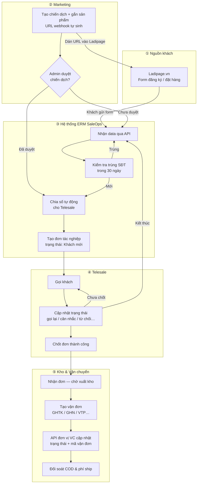

# ERM SaleOps — Hướng dẫn sử dụng & Luồng nghiệp vụ

> **Dành cho:** Quản lý, Marketing, Telesale, Kho, Kế toán — **không cần biết lập trình**.  
> **Mục đích tài liệu:** Giúp bạn hiểu *vì sao* hệ thống được thiết kế như vậy, và *làm gì* ở từng bước trong ngày làm việc thực tế.

---

## Vì sao cần một hệ thống như ERM SaleOps?

Trước đây, nhiều doanh nghiệp bán hàng qua Landing Page (Ladipage) thường gặp các vấn đ đề:

- Khách để lại SĐT trên web, nhưng **không ai gọi kịp** hoặc **gọi trùng** nhiều lần.
- Marketing chạy quảng cáo mà **không biết lead nào ra đơn**, khó tính hiệu quả.
- Telesale chốt đơn xong, **kho không biết** để xuất hàng.
- Đơn giao đi rồi, **trạng thái vận chuyển cập nhật thủ công** — dễ sai, khó đối soát tiền thu hộ (COD).

**ERM SaleOps** được thiết kế để nối liền toàn bộ chuỗi: **Quảng cáo → Lead → Gọi chốt → Kho → Vận chuyển → Đối soát**, mỗi bộ phận chỉ làm phần việc của mình trên **một nguồn dữ liệu duy nhất**.

---

## Tổng quan luồng dữ liệu

Biểu đồ dưới đây mô tả hành trình của **một khách hàng** từ lúc điền form trên Ladipage đến khi hàng được giao và đối soát tiền.

---

## Vai trò trong hệ thống — Ai làm gì?

| Vai trò | Đăng nhập demo | Việc chính |
|---------|----------------|------------|
| **Quản trị (Admin)** | `admin@saleops.local` | Duyệt chiến dịch Landing, xem toàn bộ lead, cấu hình vận chuyển |
| **Marketing** | `marketing@saleops.local` | Tạo chiến dịch, copy URL webhook sang Ladipage |
| **Chia số** | `allocator@saleops.local` | Theo dõi lead, xử lý lead chờ / lỗi |
| **Telesale** | `sales@saleops.local` | Gọi khách, chuyển trạng thái, chốt đơn |
| **Kho** | `warehouse@saleops.local` | Xuất hàng, tạo vận đơn |
| **Kế toán** | `accounting@saleops.local` | Đối soát tiền thu, trạng thái giao hàng |

Mật khẩu demo: **`password`**

---

## Bước 1 — Khách hàng đến từ Ladipage.vn

### Chuyện gì xảy ra?

Khách xem quảng cáo (Facebook, TikTok, Google…) → bấm vào link → mở **Landing Page trên Ladipage** → điền **Họ tên, SĐT, sản phẩm quan tâm** (và có thể thêm lời nhắn).

### Vì sao phải qua Ladipage?

Landing Page giúp Marketing **tùy biến giao diện, A/B test, đo lượt xem** — nhưng Ladipage **không quản lý được** việc ai gọi khách, ai chốt đơn, ai xuất kho. Vì vậy Ladipage chỉ là **cửa vào**; ERM SaleOps là **bộ não vận hành** phía sau.

> [📸 CHÈN ẢNH TẠI ĐÂY: Chụp màn hình Ladipage — form khách điền SĐT và chọn sản phẩm.  
> *Ghi chú: Ảnh lấy từ Ladipage thật của công ty bạn, không cần route hệ thống.*]

---

## Bước 2 — Marketing tạo chiến dịch & đường dẫn nhận data

### Telesale cần biết gì?

Mỗi **chiến dịch** trên ERM SaleOps tương ứng **một Landing / một sản phẩm / một marketer phụ trách**. Khi Marketing tạo chiến dịch, hệ thống **tự sinh**:

- **Mã chiến dịch (UTM)** — để phân biệt nguồn trong báo cáo.
- **URL webhook** — đường link đặc biệt mà Ladipage sẽ **gửi data khách về** mỗi khi có người điền form.

### Thao tác Marketing

1. Đăng nhập tài khoản Marketing.
2. Vào menu **Kết nối Landing** → route: **`/marketing/campaigns`**
3. Bấm **Tạo chiến dịch** → chọn **sản phẩm trong kho**, đặt tên chiến dịch.
4. **Copy URL API** hiển thị trên màn hình.
5. Dán URL đó vào cấu hình **Webhook / Form submit** trên Ladipage (theo hướng dẫn Ladipage).

> [📸 CHÈN ẢNH TẠI ĐÂY: Chụp màn hình tại `/marketing/campaigns/create` — thấy tên chiến dịch, sản phẩm gắn kèm và URL webhook tự sinh.  
> *Thao tác: Đăng nhập `marketing@saleops.local` → sidebar **Kết nối Landing** → **Tạo chiến dịch**.*]

### Vì sao cần Admin duyệt trước khi chia số?

Chiến dịch mới tạo ở trạng thái **Chờ duyệt**. Lead test vẫn **về được hệ thống**, nhưng **chưa giao cho Telesale gọi** — tránh trường hợp Marketing cấu hình sai URL, sai sản phẩm, mà Sale đã gọi ồ ạt.

Admin duyệt tại: **`/admin/landing-approvals`**

> [📸 CHÈN ẢNH TẠI ĐÂY: Chụp màn hình tại `/admin/landing-approvals` — danh sách chiến dịch chờ duyệt và nút **Duyệt**.  
> *Thao tác: Đăng nhập `admin@saleops.local` → sidebar **Duyệt Landing** → bấm duyệt một chiến dịch.*]

---

## Bước 3 — Data khách hàng đổ về hệ thống

### Hệ thống làm gì khi nhận một lead?

1. **Ghi nhận** thông tin: tên, SĐT, sản phẩm, nguồn chiến dịch.
2. **Kiểm tra trùng SĐT** trong vòng **30 ngày** — nếu trùng, đánh dấu *Lead trùng* (không tạo đơn mới, tránh gọi spam).
3. Nếu chiến dịch **đã được duyệt** → **chia số** cho Telesale và **tạo đơn tác nghiệp** (trạng thái ban đầu: **Khách mới**).
4. Gửi **thông báo** tới Telesale được phân công — kèm link thẳng tới màn hình làm việc.

Admin / Chia số theo dõi nhật ký lead tại:

- **`/admin/leads`** — toàn bộ lead ingest
- **`/allocator/workspace`** — góc nhìn bộ phận Chia số

> [📸 CHÈN ẢNH TẠI ĐÂY: Chụp màn hình tại `/admin/leads` — một dòng lead mới với trạng thái *Đã xử lý* và mã đơn liên kết.  
> *Thao tác: Sau khi gửi thử form Ladipage (hoặc dùng data demo seed), mở nhật ký lead.*]

---

## Bước 4 — Chia số tự động cho Telesale

### Thuật toán chia số — giải thích đơn giản

Hệ thống **không để Telesale tự “giành” lead** trên Excel hay chat nội bộ. Mỗi lead mới được **gán tự động** cho **một** nhân viên Sale, theo quy tắc cấu hình sẵn:

| Cách chia (cấu hình) | Ý nghĩa thực tế |
|----------------------|-----------------|
| **Luân phiên (mặc định)** | Sale A → B → C → A… Công bằng, dễ hiểu, phù hợp team đồng đều. |
| **Ít đơn nhất trong ngày** | Ưu tiên người đang “nhẹ việc” — cân bằng tải khi có người nghỉ / chậm. |
| **Ngẫu nhiên** | Phân tán đều khi không muốn theo thứ tự cố định. |

**Vì sao thiết kế vậy?**

- **Công bằng nội bộ** — hạn chế tranh chấp lead.
- **Đo hiệu suất chính xác** — biết rõ ai nhận bao nhiêu, chốt bao nhiêu.
- **Phản hồi nhanh** — khách vừa điền form đã có người phụ trách gọi.

Bộ phận Chia số theo dõi tổng quan tại **`/allocator/dashboard`**.

> [📸 CHÈN ẢNH TẠI ĐÂY: Chụp màn hình tại `/allocator/dashboard` — biểu đồ lead hôm nay, lead chờ xử lý.  
> *Thao tác: Đăng nhập `allocator@saleops.local` → mở Dashboard Chia số.*]

---

## Bước 5 — Tác nghiệp Telesale (gọi khách & chuyển trạng thái)

### Màn hình làm việc chính

Telesale vào **`/sales/workspace`** (menu sidebar: **Tác nghiệp telesale**).

Đây là **bảng hàng đợi** các đơn/lead được giao — không phải màn dashboard biểu đồ. Dashboard tổng quan Sale nằm ở **`/sales/dashboard`**.

> [📸 CHÈN ẢNH TẠI ĐÂY: Chụp màn hình tại `/sales/workspace` — bảng danh sách lead với cột Khách hàng, TN/Kết quả, Hành động.  
> *Thao tác: Đăng nhập `sales@saleops.local` → sidebar **Tác nghiệp telesale**.*]

### Các thành phần trên màn hình

| Thành phần | Ý nghĩa |
|------------|---------|
| **Bộ lọc phía trên** | Lọc theo ngày, sản phẩm, kết quả gọi, trạng thái chốt… |
| **Tab trạng thái (pipeline)** | Khách mới → Gọi lần 2…6 → Chăm sóc — giúp Sale ưu tiên việc cần làm |
| **Cột Hành động** | Nút **Gọi** và **Chuyển trạng thái** |
| **Cột Chốt** | Nút **Chốt đơn** khi khách đã đồng ý mua |

### Vì sao có nhiều “lần gọi”?

Khách không bắt máy ngay là **bình thường**. Hệ thống ghi lại từng lần liên hệ để:

- Sale **không quên** gọi lại đúng hẹn.
- Quản lý **đánh giá** nỗ lực (đã gọi mấy lần mới chốt / bỏ).
- Báo cáo CEO/Marketing phản ánh **thực tế**, không chỉ số đơn chốt.

---

### Nút **Gọi** — khi nào hiện, khi nào ẩn?

| Hiện nút Gọi | Ẩn nút Gọi |
|--------------|------------|
| Đơn **đang mở** (chưa chốt, chưa hủy) | Đơn **đã chốt** |
| Còn SĐT hợp lệ | Đơn **kết thúc** (sai số, không nhu cầu, từ chối giá…) |
| Chưa ở trạng thái “bỏ qua” | Không có SĐT |

**Cách dùng:** Bấm **Gọi** → điện thoại/máy tính mở ứng dụng gọi → hệ thống **đếm thêm 1 lần liên hệ**.

> [📸 CHÈN ẢNH TẠI ĐÂY: Chụp cận cảnh cột **Hành động** tại `/sales/workspace` — nút **Gọi** màu viền trên một đơn *Khách mới* (VD: PS-OPS-00001).  
> *Thao tác: Chọn đơn chưa chốt, zoom vào nút Gọi.*]

---

### Nút **Chuyển trạng thái** — các tình huống thực tế

Bấm **Chuyển trạng thái** → mở **cửa sổ chọn kết quả** (modal). Dưới đây là **toàn bộ kịch bản** và **việc hệ thống làm sau khi bạn lưu**.

#### Nhóm 1 — Gọi không nghe máy (Lần 1 → Lần 6)

| Bạn chọn | Ý nghĩa | Hệ thống làm gì |
|----------|---------|-----------------|
| **Gọi không nghe máy (tự tăng lần gọi)** | Vừa gọi, khách không bắt máy | Tự chuyển sang tab **Gọi lần 2**, **lần 3**… tùy đơn đang ở đâu |
| Hoặc chọn lần cụ thể (Lần 1…6) | Ghi nhận rõ lần thứ mấy | Cập nhật pipeline tương ứng |

**Mẹo:** Dùng “tự tăng lần gọi” cho nhanh — hệ thống tự biết đơn đang ở Gọi lần mấy.

Demo: đơn **PS-OPS-00002** (Gọi lần 2, không nghe máy).

#### Nhóm 2 — Hẹn gọi lại sau

| Bạn chọn | Ý nghĩa | Hệ thống làm gì |
|----------|---------|-----------------|
| **Hẹn gọi lại sau** | Khách bận, nhờ gọi lại giờ cụ thể | **Bắt buộc chọn ngày giờ hẹn** → hiển thị dòng “Hẹn: …” trên bảng |

Demo: đơn **PS-OPS-00003**.

> [📸 CHÈN ẢNH TẠI ĐÂY: Chụp modal **Chuyển trạng thái** tại `/sales/workspace` — chọn *Hẹn gọi lại sau* và thấy ô chọn ngày giờ.  
> *Thao tác: Bấm **Chuyển trạng thái** trên đơn PS-OPS-00003 → chọn Hẹn gọi lại → chọn datetime.*]

#### Nhóm 3 — Khách đang cân nhắc (chưa chốt)

| Bạn chọn | Ý nghĩa |
|----------|---------|
| **Khách đang cân nhắc** | Đã tư vấn, khách cần suy nghĩ / hỏi người nhà |
| **Đã gửi báo giá / tư vấn** | Đã gửi giá qua Zalo, Messenger… chờ phản hồi |
| **Khách đồng ý — chờ chốt** | Khách OK mua, cần xác nhận địa chỉ / COD rồi bấm Chốt đơn |

Đơn **vẫn mở** — Sale tiếp tục gọi / nhắn theo dõi.

Demo: **PS-OPS-00004** (báo giá), **PS-OPS-00005** (cân nhắc), **PS-OPS-00006** (chờ chốt).

#### Nhóm 4 — Kết thúc (không mua)

| Bạn chọn | Ý nghĩa | Sau khi lưu |
|----------|---------|-------------|
| **Sai số / nhầm số** | SĐT không tồn tại hoặc không phải khách | Đơn **kết thúc** — **ẩn** nút Gọi / Chuyển trạng thái |
| **Không có nhu cầu** | Khách nói không mua | Tương tự — kết thúc |
| **Từ chối — giá cao** | Khách so giá sàn, không chốt | Pipeline → **Bỏ qua** |

Demo: **PS-OPS-00010** (từ chối giá), **PS-OPS-00011** (sai số).

> [📸 CHÈN ẢNH TẠI ĐÂY: Chụp modal tại `/sales/workspace` — dropdown kết quả tác nghiệp, nhóm *Kết thúc tác nghiệp* (Sai số, Không nhu cầu…).  
> *Thao tác: Mở **Chuyển trạng thái** trên đơn PS-OPS-00010 hoặc 00011.*]

#### Nhóm 5 — Đã chốt đơn thành công

| Bạn chọn | Ý nghĩa |
|----------|---------|
| **Đã chốt đơn thành công** (trong modal) | Xác nhận chốt ngay trong luồng trạng thái |

Hoặc bấm riêng nút **Chốt đơn** ở cột bên cạnh — hai cách đều đưa đơn sang bước Kho.

Sau khi chốt: **ẩn** Gọi / Chuyển trạng thái; hiện **“Đã chốt”**.

> [📸 CHÈN ẢNH TẠI ĐÂY: Chụp modal tại `/sales/workspace` — chọn *Đã chốt đơn thành công* HOẶC chụp nút **Chốt đơn** + hộp xác nhận.  
> *Thao tác: Dùng đơn PS-OPS-00006 (khách đồng ý COD) → Chốt đơn.*]

---

### Bảng tóm tắt: Trạng thái → Sale làm gì tiếp?

| Tình huống | Sale nên làm |
|------------|--------------|
| Khách mới, chưa gọi | Gọi lần 1 |
| Không nghe máy | Chuyển trạng thái → gọi lại sau vài giờ |
| Hẹn gọi lại | Đến giờ hẹn → Gọi lại |
| Cân nhắc / đã báo giá | Theo dõi Zalo, gọi nhắc nhẹ |
| Đồng ý mua | **Chốt đơn** + xác nhận địa chỉ giao |
| Sai số / không nhu cầu | Dừng — báo Marketing nếu nguồn lead kém |
| Đã chốt | Không gọi nữa — Kho lo phần giao hàng |

---

## Bước 6 — Chốt đơn: đơn đi đâu?

Khi Telesale **chốt đơn thành công**:

1. Đơn chuyển trạng thái **Đã chốt**.
2. Pipeline Telesale chuyển sang **Chăm sóc lần 1** (giai đoạn hậu bán nếu cần).
3. Đơn **xuất hiện ở Kho** — trạng thái giao hàng: **Chờ vận đơn**.
4. Hệ thống **có thể tự tạo vận đơn** với đơn vị vận chuyển đã cấu hình (VD: GHTK) — nếu bật tích hợp.

**Vì sao tách bước “chốt” và “giao hàng”?**

- Telesale chỉ cần **chốt ý định mua + thu thập địa chỉ**.
- Kho lo **đóng gói, cân nặng, đối tác ship** — tránh Sale phải biết nghiệp vụ logistics.

Telesale xem lại khách cũ tại **`/sales/customers`** (Hồ sơ KH).

> [📸 CHÈN ẢNH TẠI ĐÂY: Chụp màn hình tại `/sales/workspace` — đơn PS-OPS-00007 cột **Chốt đơn** hiển thị *Đã chốt*, không còn nút Gọi.  
> *Thao tác: So sánh với đơn PS-OPS-00001 (còn nút Gọi).*]

---

## Bước 7 — Kho, Vận chuyển & Đối soát

### Kho nhận đơn và tạo vận đơn

Nhân viên Kho vào **`/warehouse/workspace`** (hoặc Admin: **`/admin/warehouse/operations`**).

Việc cần làm:

1. Kiểm tra đơn **Chờ vận đơn**.
2. Xác nhận tồn kho sản phẩm.
3. **Tạo vận đơn** với đơn vị vận chuyển (GHTK, GHN, Viettel Post…).

> [📸 CHÈN ẢNH TẠI ĐÂY: Chụp màn hình tại `/admin/shipping/orders` hoặc `/warehouse/workspace` — danh sách đơn chờ tạo vận đơn.  
> *Thao tác: Đăng nhập `warehouse@saleops.local` hoặc admin → mở Đơn vận chuyển / Tác nghiệp kho.*]

### Vì sao trạng thái & mã vận đơn do API vận chuyển cung cấp?

Sau khi tạo vận đơn, **đơn vị vận chuyển** (không phải SaleOps) mới là nơi biết chính xác:

- Mã vận đơn (tracking)
- Shipper đã lấy hàng chưa
- Đang giao / giao thành công / hoàn / hủy

Nếu nhập tay từng trạng thái → **dễ sai, chậm, không đối soát được COD**.

ERM SaleOps thiết kế để:

1. **Gửi đơn sang API** đối tác (tạo vận đơn).
2. **Nhận webhook ngược** khi trạng thái thay đổi trên hành trình giao.
3. **Tự cập nhật** mã vận đơn + trạng thái trên hệ thống.

Cấu hình API vận chuyển (Admin): **`/admin/shipping-partners`**

> [📸 CHÈN ẢNH TẠI ĐÂY: Chụp màn hình tại `/admin/shipping-partners` — cấu hình GHTK/GHN/VTP.  
> *Thao tác: Admin → sidebar **API vận chuyển**.*]

### Đối soát nghiệp vụ

Kế toán / Admin đối chiếu:

- Tiền COD thu được vs đơn **Đã giao / Đã thanh toán**
- Phí vận chuyển, hỗ trợ ship
- Đơn hoàn, hủy vận đơn

Màn hình đối soát: **`/admin/shipping/reconciliation`**

Kế toán tác nghiệp hàng ngày: **`/accounting/workspace`**

> [📸 CHÈN ẢNH TẠI ĐÂY: Chụp màn hình tại `/admin/shipping/reconciliation` — bảng đối soát trạng thái giao & mã vận đơn.  
> *Thao tác: Admin → sidebar **Đối soát vận chuyển**.*]

### Chuỗi trạng thái giao hàng (dễ hiểu)

| Trạng thái trên hệ thống | Ý nghĩa với khách |
|-------------------------|-------------------|
| Chờ vận đơn | Sale đã chốt, Kho chưa bàn giao ship |
| Đang lấy hàng / Chờ giao | Shipper sắp / đang lấy hàng |
| Đang giao hàng | Shipper đang trên đường |
| Đã giao hàng | Khách đã nhận |
| Đã thanh toán | Tiền COD đã về (đối soát) |
| Đã hoàn / Hủy vận đơn | Khách không nhận hoặc hủy — Kế toán xử lý |

---

## Phụ lục — Danh sách route nhanh

| Màn hình | Route | Ai dùng |
|----------|-------|---------|
| Dashboard Telesale | `/sales/dashboard` | Telesale |
| **Tác nghiệp Telesale** | **`/sales/workspace`** | Telesale |
| Hồ sơ khách hàng | `/sales/customers` | Telesale |
| Kết nối Landing | `/marketing/campaigns` | Marketing |
| Duyệt Landing | `/admin/landing-approvals` | Admin |
| Nhật ký lead | `/admin/leads` | Admin |
| Chia số & lead | `/allocator/workspace` | Chia số |
| Tác nghiệp kho | `/warehouse/workspace` | Kho |
| Đơn vận chuyển | `/admin/shipping/orders` | Admin / Kho |
| Đối soát vận chuyển | `/admin/shipping/reconciliation` | Admin / Kế toán |
| Sơ đồ tổ chức | `/org-chart` | Mọi role |
| Cài đặt cá nhân | `/settings` | Mọi role |

---

## Ghi chú khi chụp ảnh minh họa

1. Dùng **data demo** sau lệnh `php artisan migrate --seed` — có sẵn 12 đơn mẫu `PS-OPS-00001` … `00012`.
2. Đăng nhập đúng **role** cho từng màn (Sale không mở được màn Admin).
3. Chụp **full màn hình** + **zoom modal** ở các bước quan trọng (chuyển trạng thái, chốt đơn, đối soát).
4. Thay placeholder `[📸 CHÈN ẢNH TẠI ĐÂY: …]` bằng ảnh PNG/JPG cùng tên mô tả.

---

*Tài liệu này bám theo luồng nghiệp vụ ERM SaleOps phiên bản hiện tại. Chi tiết kỹ thuật API/webhook: xem [`docs/INTEGRATIONS.md`](INTEGRATIONS.md).*
